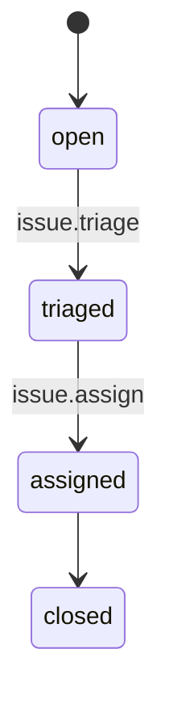

# GitHub Triage Process Map

## Issue

## Unit Processes

- `issue.triage`: Issue -> Issue; emits issue.triaged
- `issue.assign`: Issue -> Issue; emits issue.assigned
- `issue.comment`: Issue -> no writes; emits none
